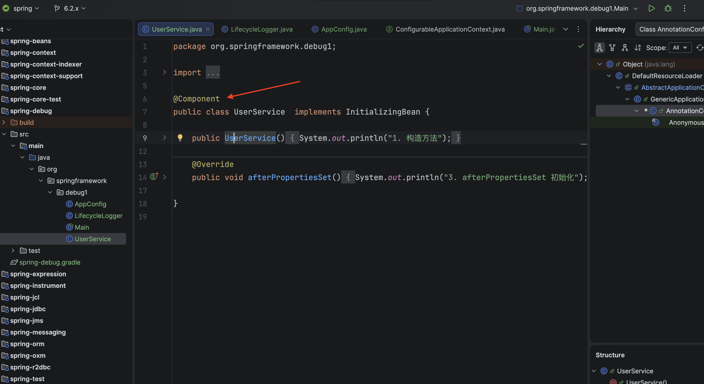
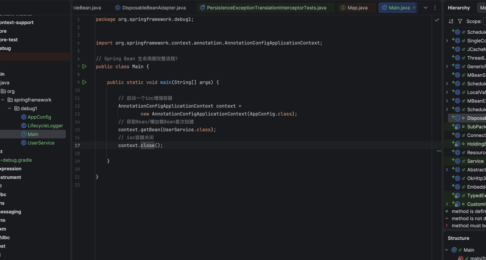
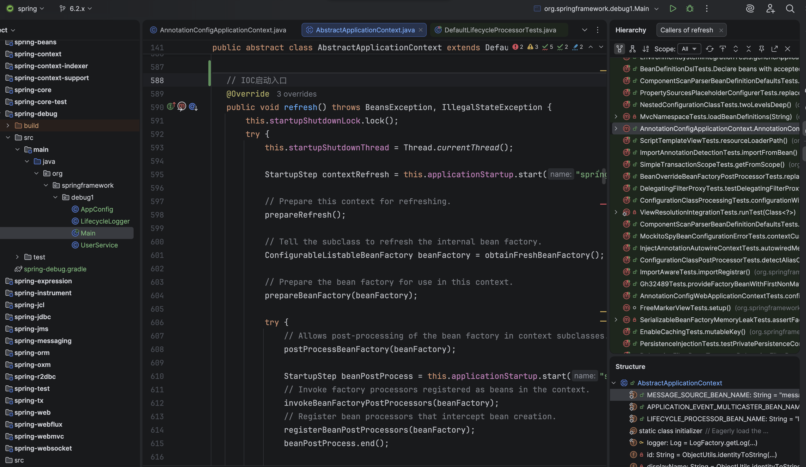
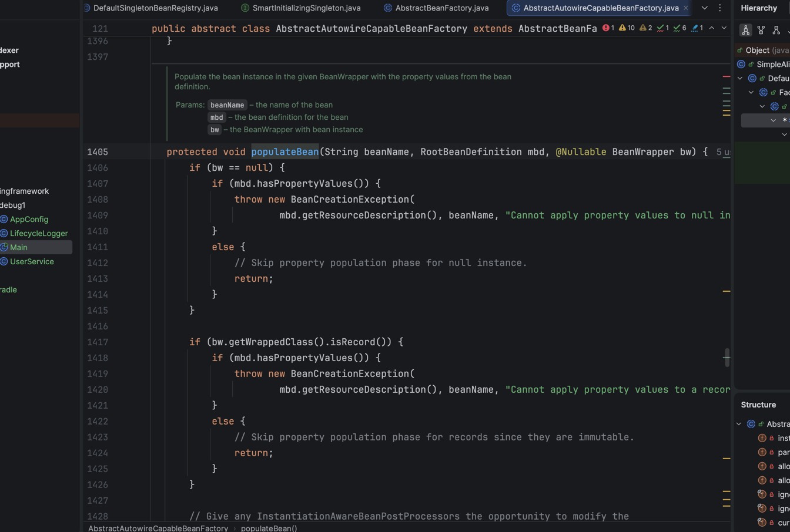
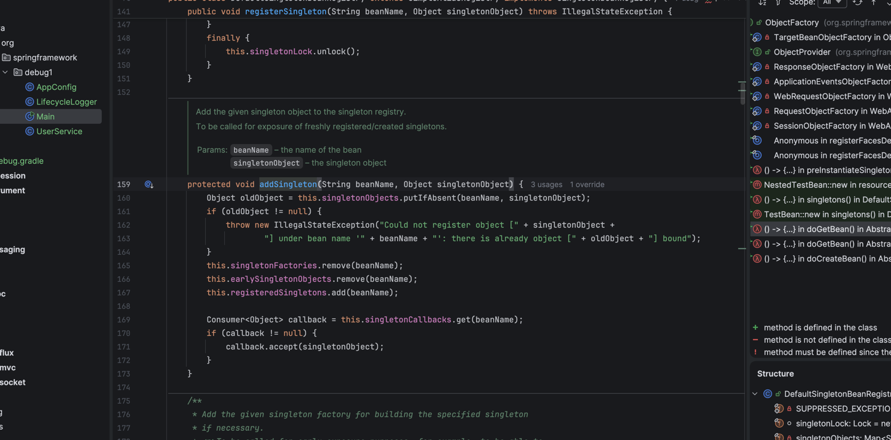
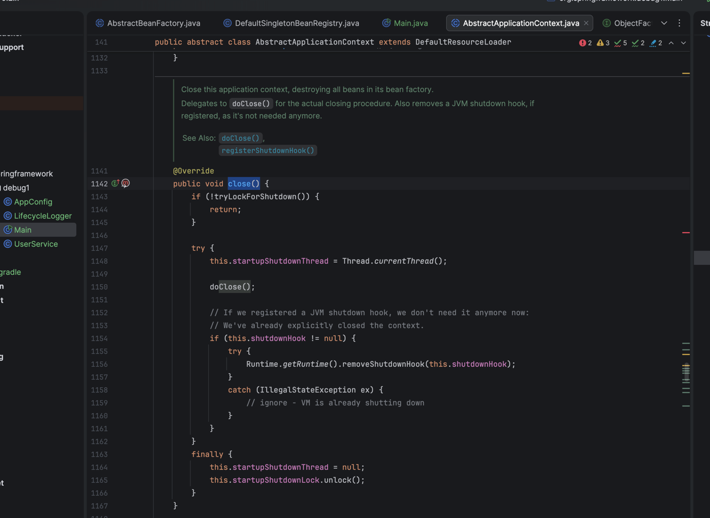
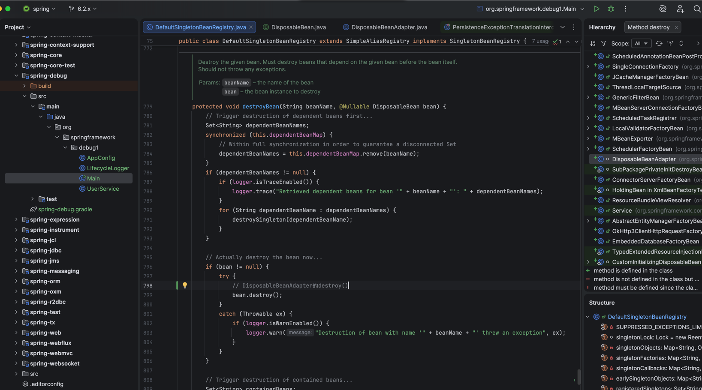
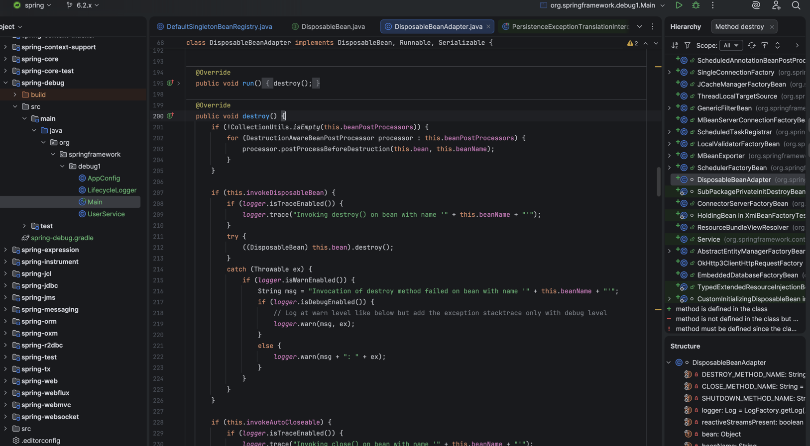

## 1. 首先在类上加 @Component  
     
## 2. 使用AnnotationConfigApplicationContext IOC增强容器启动  
     
## 3. 进入IOC启动入口  
   ``refresh()``
   
## 4. 制作一个Bean
   ``
      refresh() 
      -> finishBeanFactoryInitialization()  
      -> beanFactory.preInstantiateSingletons()  
      -> preInstantiateSingleton()  
      -> instantiateSingleton()  
      -> getBean()  
      -> doGetBean()  
      -> createBean()  
      -> doCreateBean()  
   ``
     
## 5. 实例化(new)  
   ``
      doCreateBean()  
      -> createBeanInstance()  
   ``
     
## 6. 构造函数依赖注入(@Autowired)
   ``
      doCreateBean()  
      -> populateBean()  
   ``  
     
## 7. 初始化AOP代理  
   有接口反射运行时调用目标 (轻量,稳定,面向接口编程)  
   没有接口CGLIB内部使用asm直接修改字节码 (兜底)  
   ``
      doCreateBean()  
      -> initializeBean()  
   ``  
     
## 8. 到这里就成功实例化了一个bean  
   放入singletonObjectsMap缓存  

   ``
      refresh()  
      -> finishBeanFactoryInitialization()  
      -> beanFactory.preInstantiateSingletons()  
      -> preInstantiateSingleton()  
      -> instantiateSingleton()  
      -> getBean()  
      -> doGetBean()      
      -> getSingleton()  
      -> addSingleton()
   ``  
     
## 9. 容器关闭  
   ``close()``  
     
## 10. 调用DisposableBeanAdapter的destroy()进行销毁  
   ``
       close()   
       -> doClose()  
       -> destroyBeans()  
       -> destroySingletons()  
       -> destroySingleton()  
       -> destroyBean()  
       -> bean.destroy()   
   ``  
     
     

- Materials
   - [Bean生命周期](../public/issues/spring/pdf/Bean%E7%94%9F%E5%91%BD%E5%91%A8%E6%9C%9F.pdf)
   - [debug](https://github.com/wangxiang4/spring-framework/tree/6.2.x/spring-debug/src/main/java/org/springframework/debug1)
