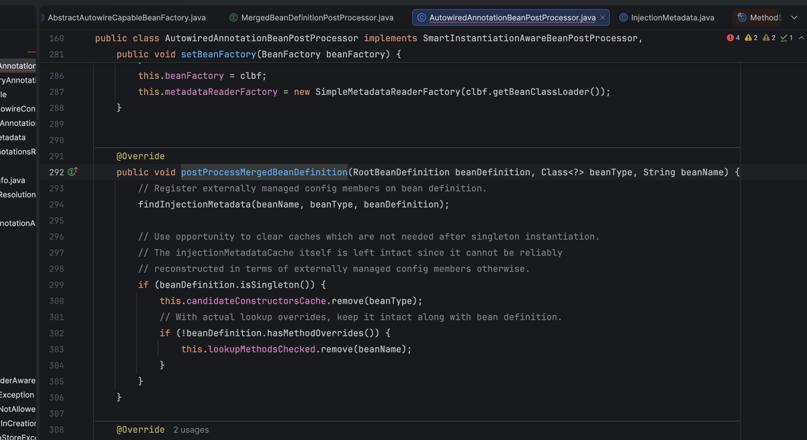
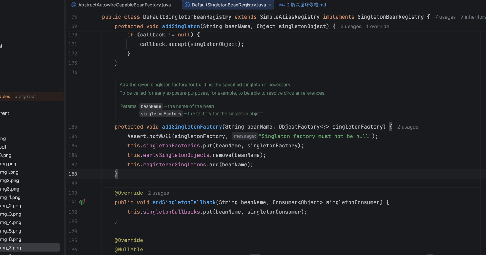
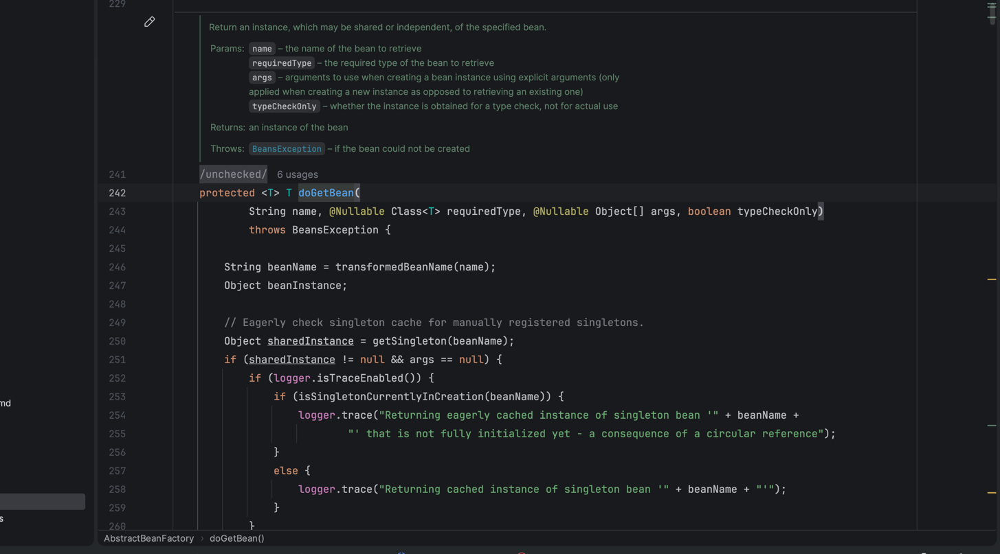
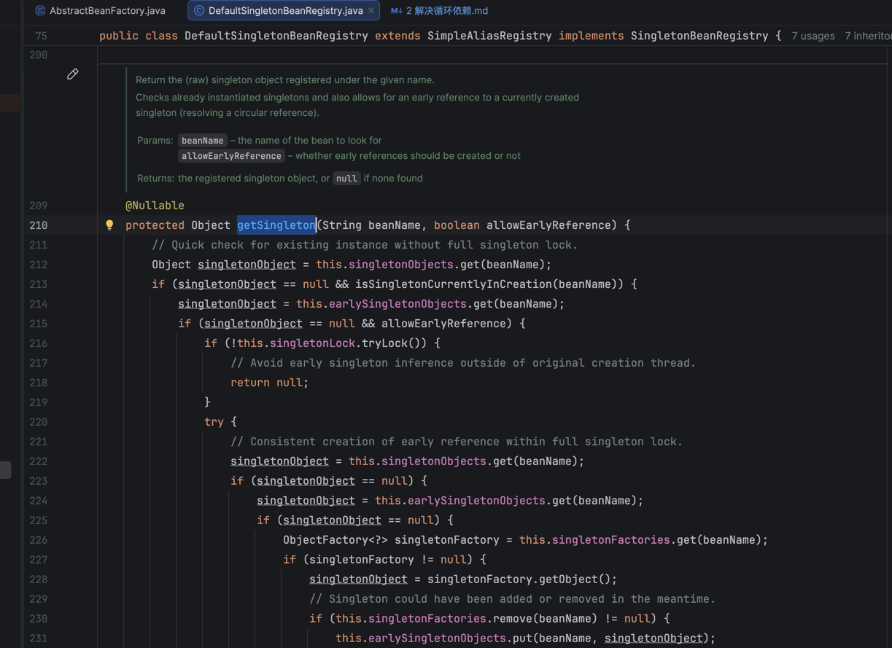
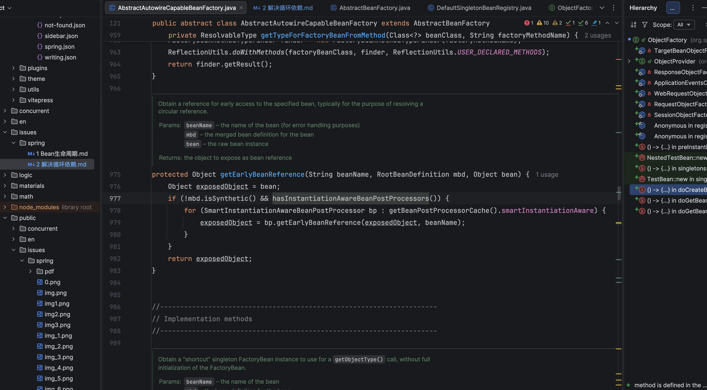
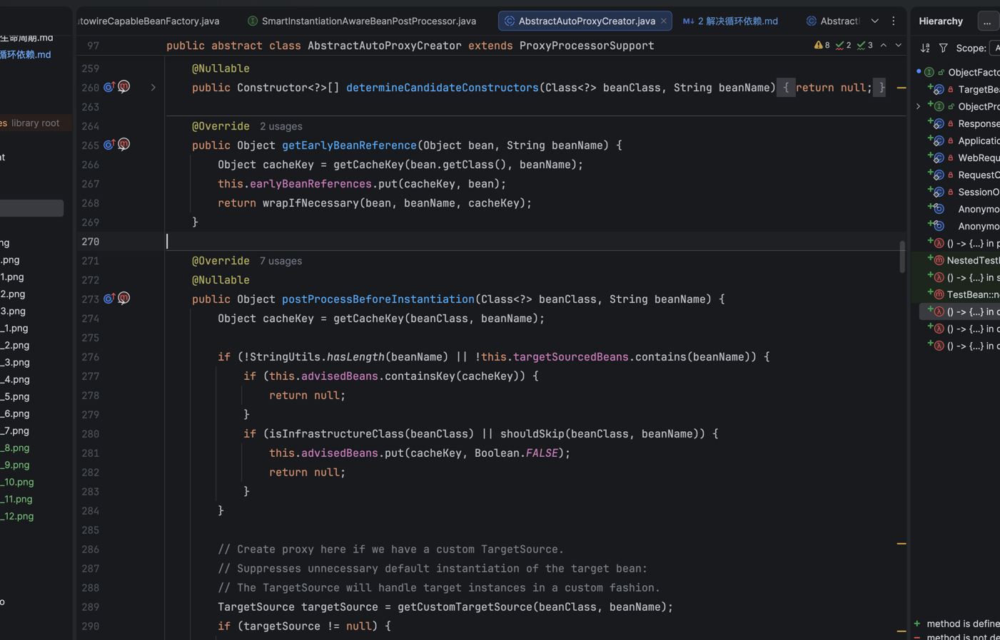
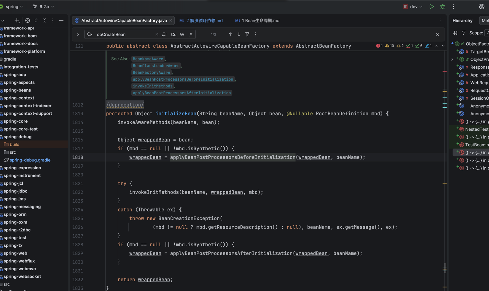
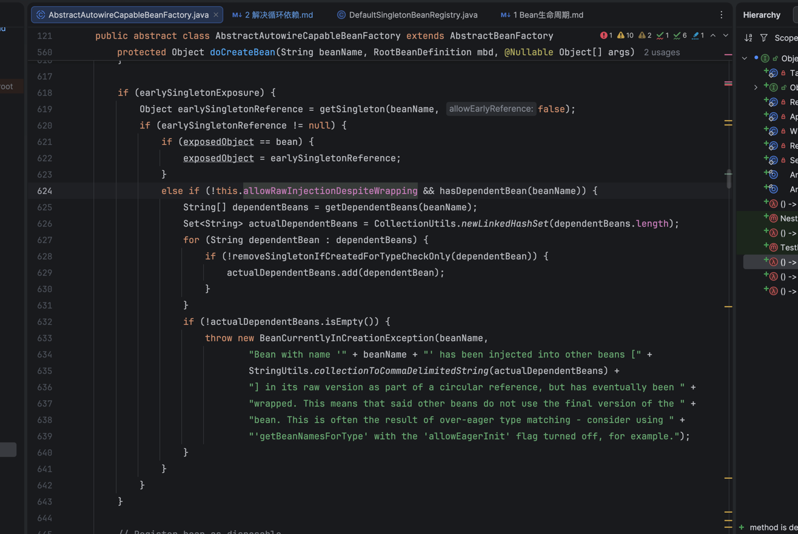
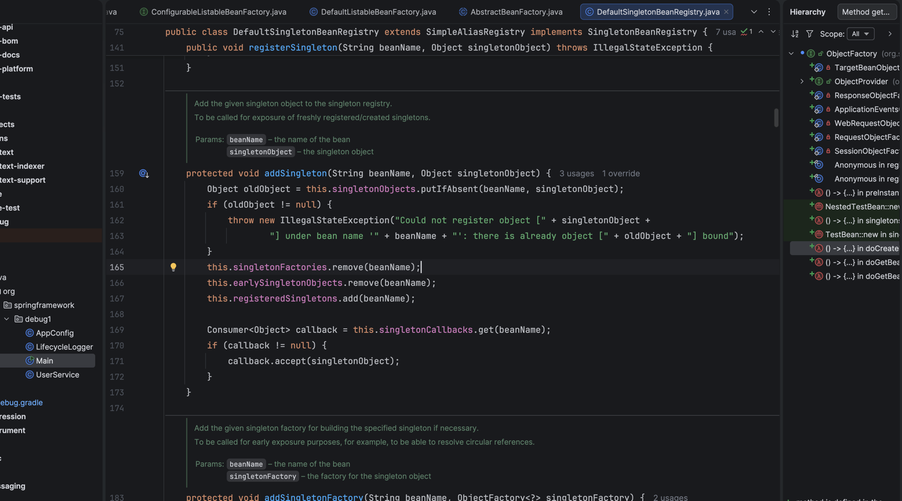

# 解决循环依赖 (解锁传送锚点)


## 1. 制作一个Bean
``
   refresh() 
   -> finishBeanFactoryInitialization()  
   -> beanFactory.preInstantiateSingletons()  
   -> preInstantiateSingleton()  
   -> instantiateSingleton()  
   -> getBean()  
   -> doGetBean()  
   -> createBean()  
   -> doCreateBean()  
``
  

## 2. 实例化(new)
new对象里没有注入依赖无AOP  
``
   doCreateBean()  
   -> createBeanInstance()  
``


## 3. 解析@Autowired并缓存到Map
``
   doCreateBean()  
   -> applyMergedBeanDefinitionPostProcessors()  
   -> postProcessMergedBeanDefinition()
``


## 2. 提前暴露三级缓存EarlyBean生成函数
``
  doCreateBean()
  -> addSingletonFactory()
``  


## 3. 递归注入Bean, 触发循环依赖
``
  doCreateBean()
  -> populateBean()
  -> applyPropertyValues()
  -> resolveValueIfNecessary()
  -> resolveReference()
  -> getBean()
  -> doGetBean()
``  
  


## 4. 获取三级缓存EarlyBean生成函数及删除当前三级缓存, 生成EarlyBean放入二级缓存中

``
doGetBean()
-> getSingleton()
``



## 5. 是否将原始对象(e.g. UserService)注入AOP代理(接口反射,无接口asm修改字节码)

``
doGetBean()
-> getSingleton()
-> singletonFactory.getObject()
-> getEarlyBeanReference()
``  
  
  

## 6. 初始化Bean, 此时二级缓存中的EarlyBean已经完全可用, 但是无状态对象状态(初始化 + 生命周期回调钩子), 这里不会在处理AOP因为getEarlyBeanReference()已经处理完了
``
  doCreateBean()
  -> initializeBean()
``  



## 7. 保证EarlyBean和最终对象一致
```
  如果最终对象还是原始对象，则用EarlyBean替换
  doCreateBean() -> exposedObject = earlySingletonReference
```
  


## 8. 删除earlySingletonObjects二级缓存放入singletonObjects一级缓存

``
   refresh()  
   -> finishBeanFactoryInitialization()  
   -> beanFactory.preInstantiateSingletons()  
   -> preInstantiateSingleton()  
   -> instantiateSingleton()  
   -> getBean()  
   -> doGetBean()      
   -> getSingleton()  
   -> addSingleton()
``  



- Materials
  - [debug](https://github.com/wangxiang4/spring-framework/tree/6.2.x/spring-debug/src/main/java/org/springframework/debug1)
