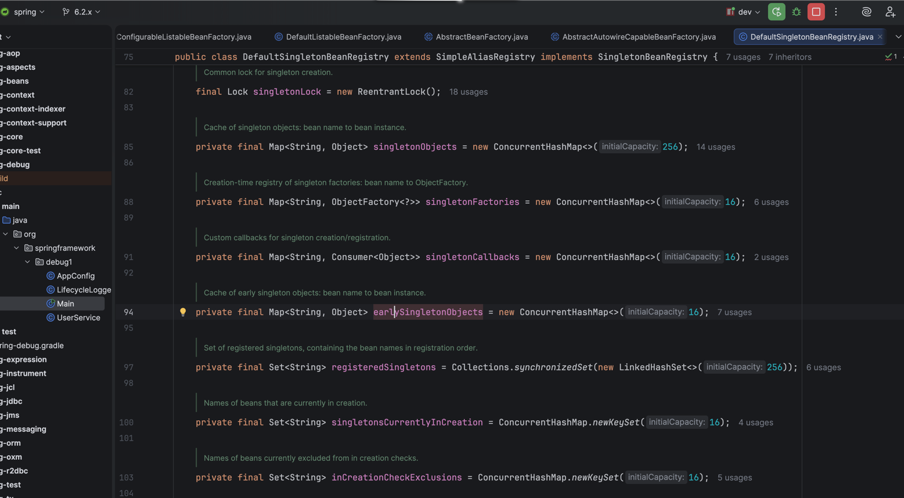
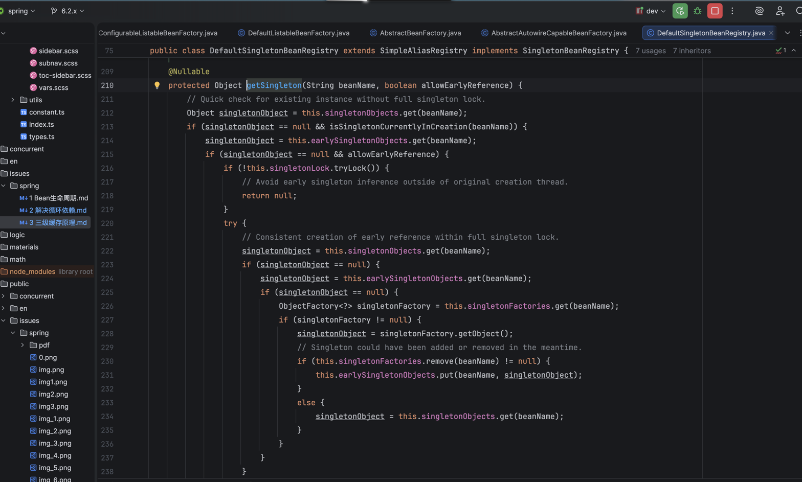

# 三级缓存原理 (解锁传送锚点)

## 1.三级缓存存在的原因就是被现实逼出来的

## 2.只用二级缓存可以,但是必须在二级缓存处  
1. 标记是否已经代理过
2. 控制只能执行一次
3. 控制执行时机（不能太早/太晚）
4. 处理并发
5. 区分未执行逻辑和执行结果

``
refresh()
-> finishBeanFactoryInitialization()  
-> beanFactory.preInstantiateSingletons()  
-> preInstantiateSingleton()  
-> instantiateSingleton()  
-> getBean()  
-> doGetBean()  
-> getSingleton()
``

## 3.最终处理上面哪些问题可以放在二级缓存map给每个对象加字段但是会出现增加代码的复杂度,状态管理复杂,反正就是不如抽出来一个map单独维护好用,状态不对执行会出现AOP失效或循环依赖死锁

__演化路径__  
__一级缓存__: 工厂创建一个单例Bean然后存进去  
__二级缓存__: 解决循环依赖  
此时出现问题   
通过引入Factory解决等有Bean依赖它时才执行创建逻辑  
通过引入Factory单独一层map缓存区分状态 factory(未执行) earlyBean(已执行)  
最终变成 __三级缓存__

