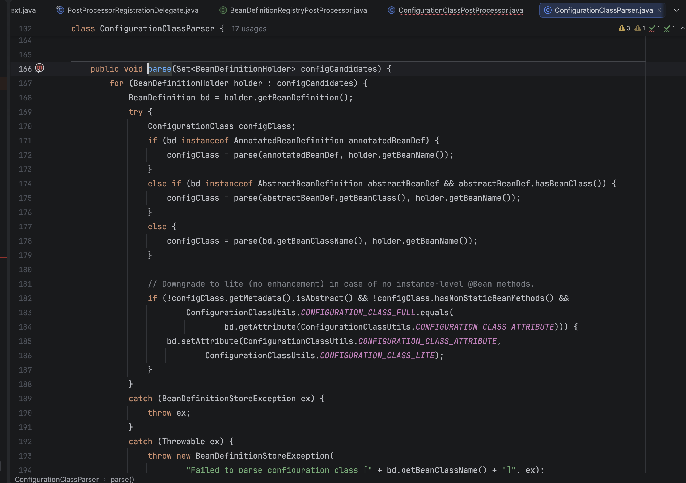
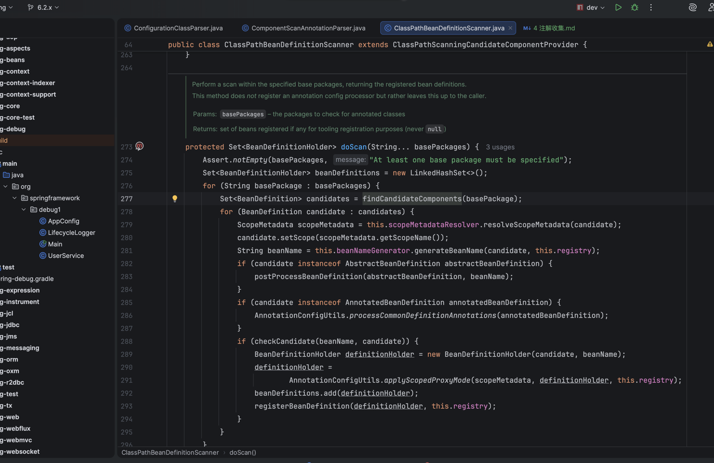
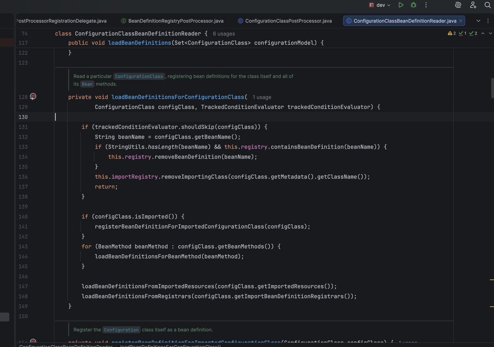
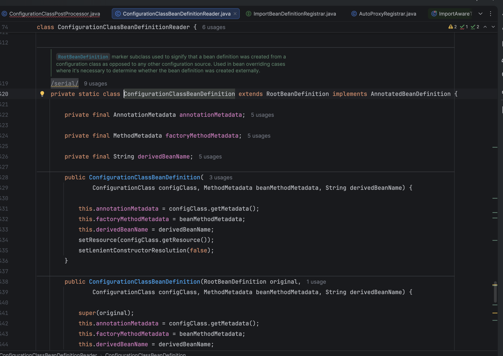
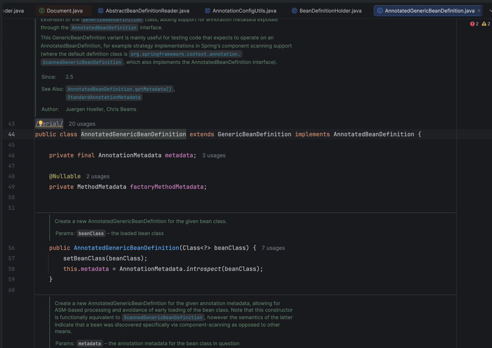
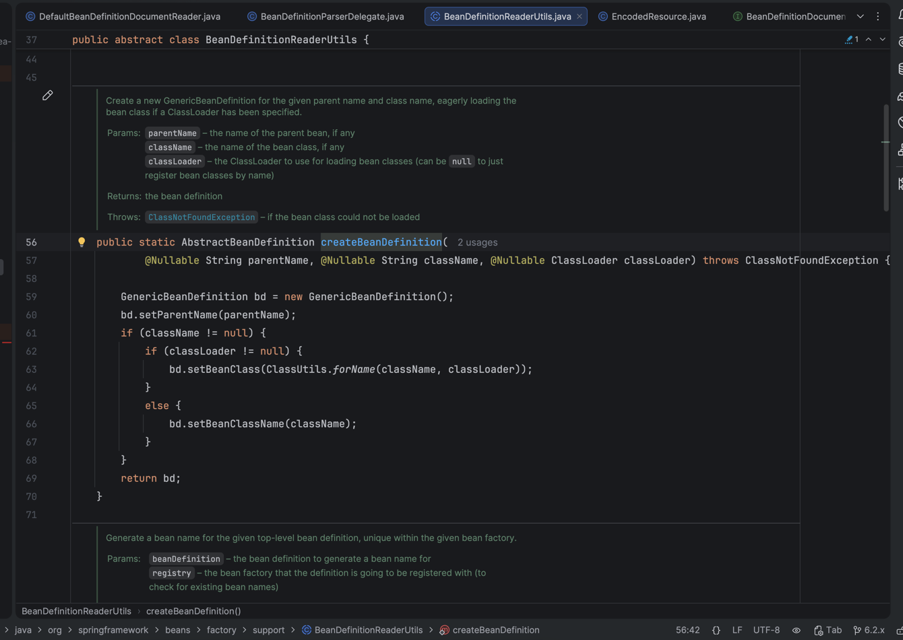
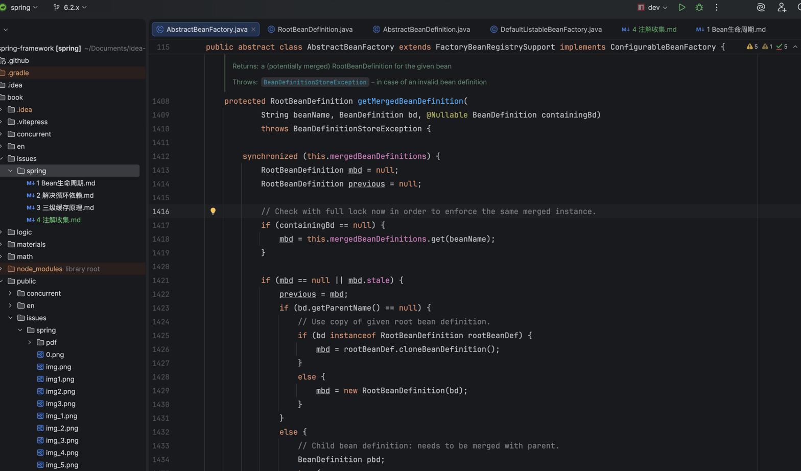
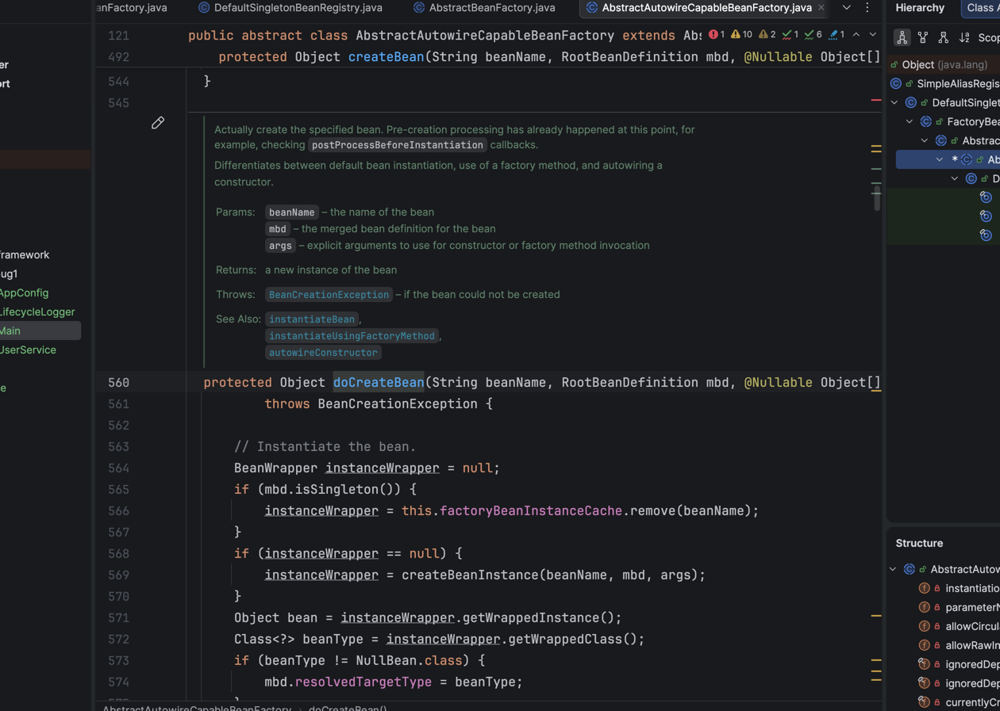
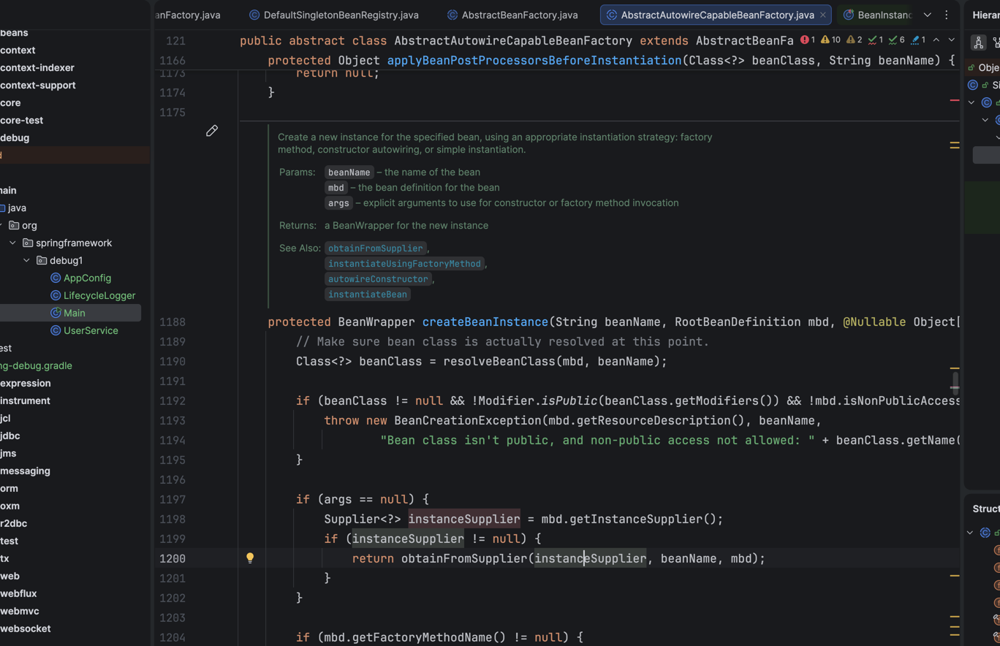
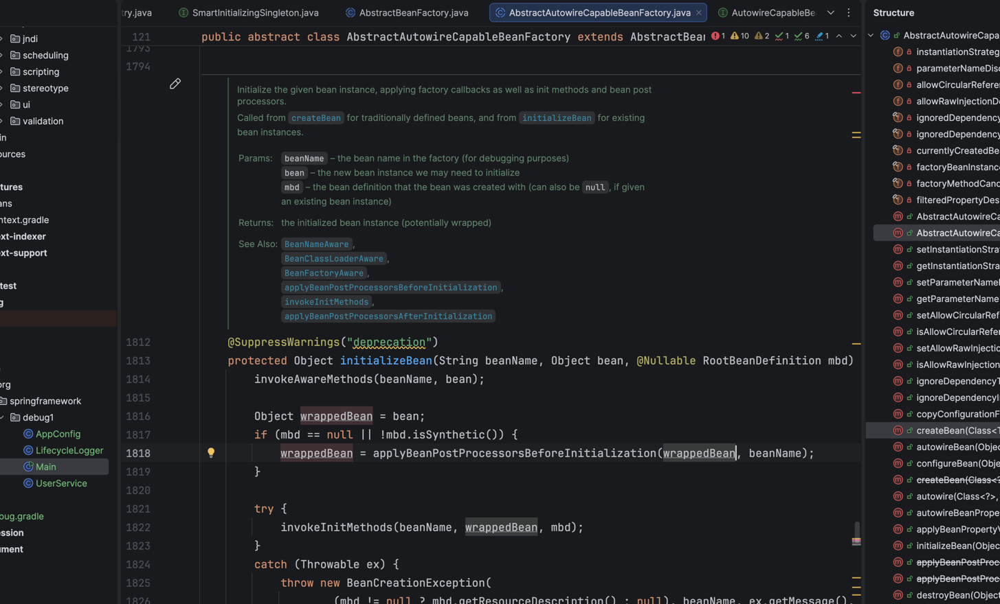

# 注解收集 (解锁传送锚点)

## 1.解析@Configuration类并把信息保存到ConfigurationClass中
```
refresh()
-> invokeBeanFactoryPostProcessors(beanFactory)
-> PostProcessorRegistrationDelegate.invokeBeanFactoryPostProcessors()
-> registryProcessor.postProcessBeanDefinitionRegistry(registry)
-> processConfigBeanDefinitions(registry)
-> parser.parse(candidates)
```  



## 2.扫描@ComponentScan生成对应的GenericBeanDefinition
```
parser.parse(candidates)
-> parse(annotatedBeanDef, holder.getBeanName())
-> processConfigurationClass()
-> doProcessConfigurationClass()
-> this.componentScanParser.parse()
-> scanner.doScan()
```  
  


## 3.根据@Configuration类中的@Bean方法还有一些@Import或者@ImportResource(XML)生成对应的BeanDefinition  
```
refresh()
-> invokeBeanFactoryPostProcessors(beanFactory)
-> PostProcessorRegistrationDelegate.invokeBeanFactoryPostProcessors()
-> registryProcessor.postProcessBeanDefinitionRegistry(registry)
-> processConfigBeanDefinitions(registry)
-> this.reader.loadBeanDefinitions(configClasses)
-> loadBeanDefinitionsForConfigurationClass()
```  


@Bean -> ConfigurationClassBeanDefinition = RootBeanDefinition  
  
默认@Import(xxx.class) 是 @Import -> AnnotatedGenericBeanDefinition = GenericBeanDefinition      
可通过loadBeanDefinitionsFromRegistrars自定义GenericBeanDefinition或RootBeanDefinition    
  
@ImportResource -> GenericBeanDefinition  
  


## 4.BeanDefinition(e.g. GenericBeanDefinition)合并生成最终RootBeanDefinition
```
  refresh() 
  -> finishBeanFactoryInitialization()  
  -> beanFactory.preInstantiateSingletons()  
  -> preInstantiateSingleton()  
  -> instantiateSingleton()  
  -> getBean()  
  -> doGetBean()  
  -> getMergedLocalBeanDefinition(beanName)
  -> getMergedBeanDefinition()
  -> getMergedBeanDefinition(beanName, bd, null)
```  


## 5.制作一个Bean
``
   refresh() 
   -> finishBeanFactoryInitialization()  
   -> beanFactory.preInstantiateSingletons()  
   -> preInstantiateSingleton()  
   -> instantiateSingleton()  
   -> getBean()  
   -> doGetBean()  
   -> createBean()  
   -> doCreateBean()  
``


## 6.实例化(new)
``
   doCreateBean()  
   -> createBeanInstance()  
``


## 7.初始化AOP代理
有接口反射运行时调用目标 (轻量,稳定,面向接口编程)  
没有接口CGLIB内部使用asm直接修改字节码 (兜底)  
``
   doCreateBean()  
   -> initializeBean()  
``  
  


- Materials
  - [注解收集](../../public/issues/spring/pdf/%E6%B3%A8%E8%A7%A3%E6%94%B6%E9%9B%86.pdf)
